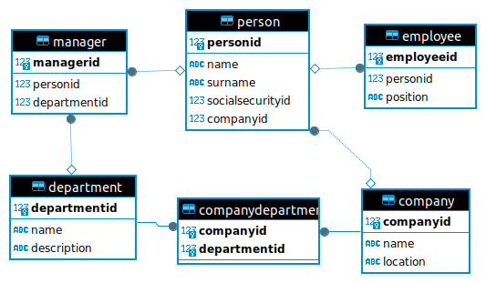
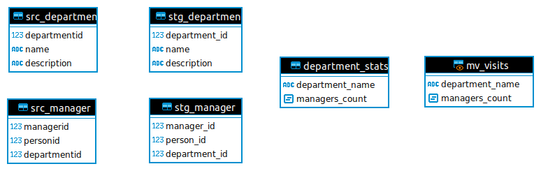

Есть операционная база (postgres) hr-отдела предприятия.

Схема БД:



Инструкция:
- Запустить postgreSQL, создать структуру таблиц и наполнить их данными
- Подключиться к postgresql с помощью clickhouse
- Создать таблицы слоя STAGE
- Организовать хранение данных в слое DDS согласно модели “звезда” или “снежинка”
- В слое CDM отобразить информацию о количестве менеджеров, сотрудников в отделах.

Скрипт для создания таблиц:

```sql
CREATE TABLE Manager (
  ManagerID SERIAL PRIMARY KEY,
  PersonID INT,
  DepartmentID INT,
  FOREIGN KEY (PersonID) REFERENCES Person(PersonID),
  FOREIGN KEY (DepartmentID) REFERENCES Department(DepartmentID)
);

CREATE TABLE Person (
  PersonID SERIAL PRIMARY KEY,
  Name VARCHAR(255),
  Surname VARCHAR(255),
  SocialSecurityID BIGINT,
  CompanyID INT,
  FOREIGN KEY (CompanyID) REFERENCES Company(CompanyID)
);

CREATE TABLE Employee (
  EmployeeID SERIAL PRIMARY KEY,
  PersonID INT,
  Position VARCHAR(255),
  FOREIGN KEY (PersonID) REFERENCES Person(PersonID)
);

CREATE TABLE Company (
  CompanyID SERIAL PRIMARY KEY,
  Name VARCHAR(255),
  Location VARCHAR(255)
);

CREATE TABLE CompanyDepartment (
  CompanyID INT,
  DepartmentID INT,
  PRIMARY KEY (CompanyID, DepartmentID),
  FOREIGN KEY (CompanyID) REFERENCES Company(CompanyID),
  FOREIGN KEY (DepartmentID) REFERENCES Department(DepartmentID)
);

CREATE TABLE Department (
  DepartmentID SERIAL PRIMARY KEY,
  Name VARCHAR(255),
  Description VARCHAR(255)
);
```

Наполним данными:
```sql
insert into Department(DepartmentID, Name, Description) values(1, 'Департамент анализа рисков', 'Анализ рисков');
insert into Department(DepartmentID, Name, Description) values(2, 'Департамент противодействия недобросовестным практикам', 'Антифрод');

insert into Company(CompanyID, Name) values(1, 'Южуралзолото');
insert into Company(CompanyID, Name) values(2, 'Тинькоф');
insert into Company(CompanyID, Name) values(3, 'Сбербанк');
insert into Company(CompanyID, Name) values(4, 'Альфа-банк');

insert into CompanyDepartment(CompanyID, DepartmentID) values(1, 1);
insert into CompanyDepartment(CompanyID, DepartmentID) values(1, 2);
insert into CompanyDepartment(CompanyID, DepartmentID) values(2, 1);
insert into CompanyDepartment(CompanyID, DepartmentID) values(2, 2);
insert into CompanyDepartment(CompanyID, DepartmentID) values(3, 1);
insert into CompanyDepartment(CompanyID, DepartmentID) values(3, 2);
insert into CompanyDepartment(CompanyID, DepartmentID) values(4, 1);
insert into CompanyDepartment(CompanyID, DepartmentID) values(4, 2);

-- Южуралзолото	Департамент анализа рисков	Анализ рисков	Joseph	Mcdonald	Mining engineer	755896523	Employee
-- Южуралзолото	Департамент анализа рисков	Анализ рисков	Joseph	Chavez	Chemical engineer	144798591	Employee
-- Южуралзолото	Департамент анализа рисков	Анализ рисков	Veronica	Moore	Animal technologist	19620426	Employee
-- Южуралзолото	Департамент анализа рисков	Анализ рисков	Sandra	Taylor	Immigration officer	662651852	Employee
-- Южуралзолото	Департамент анализа рисков	Анализ рисков	Wendy	Bryant	Clinical molecular geneticist	725056669	Employee
-- Южуралзолото	Департамент анализа рисков	Анализ рисков	Cameron	King	Software engineer	152188671	Employee
-- Южуралзолото	Департамент анализа рисков	Анализ рисков	Karen	Scott	Armed forces logistics/support/administrative officer	178787257	Employee
-- Южуралзолото	Департамент анализа рисков	Анализ рисков	Margaret	Fox	Lexicographer	560449514	Employee
-- Южуралзолото	Департамент анализа рисков	Анализ рисков	Evan	Nunez	Scientist, physiological	385596637	Employee

insert into Person(PersonID, Name, Surname, SocialSecurityID, CompanyID) values(1, 'Joseph', 'Mcdonald', 755896523, 1);
insert into Person(PersonID, Name, Surname, SocialSecurityID, CompanyID) values(2, 'Joseph', 'Chavez', 144798591, 1);
insert into Person(PersonID, Name, Surname, SocialSecurityID, CompanyID) values(3, 'Veronica', 'Moore', 19620426, 1);
insert into Person(PersonID, Name, Surname, SocialSecurityID, CompanyID) values(4, 'Sandra', 'Taylor', 662651852, 1);
insert into Person(PersonID, Name, Surname, SocialSecurityID, CompanyID) values(5, 'Wendy', 'Bryant', 725056669, 1);
insert into Person(PersonID, Name, Surname, SocialSecurityID, CompanyID) values(6, 'Cameron', 'King', 152188671, 1);
insert into Person(PersonID, Name, Surname, SocialSecurityID, CompanyID) values(7, 'Karen', 'Scott', 178787257, 1);
insert into Person(PersonID, Name, Surname, SocialSecurityID, CompanyID) values(8, 'Margaret', 'Fox', 755896523, 1);
insert into Person(PersonID, Name, Surname, SocialSecurityID, CompanyID) values(9, 'Evan', 'Nunez', 385596637, 1);

insert into Employee(EmployeeID, PersonID, Position) values(1, 1, 'Mining engineer');
insert into Employee(EmployeeID, PersonID, Position) values(2, 2, 'Chemical engineer');
insert into Employee(EmployeeID, PersonID, Position) values(3, 3, 'Animal technologist');
insert into Employee(EmployeeID, PersonID, Position) values(4, 4, 'Immigration officer');
insert into Employee(EmployeeID, PersonID, Position) values(5, 5, 'Clinical molecular geneticist');
insert into Employee(EmployeeID, PersonID, Position) values(6, 6, 'Software engineer');
insert into Employee(EmployeeID, PersonID, Position) values(7, 7, 'Armed forces logistics/support/administrative officer');
insert into Employee(EmployeeID, PersonID, Position) values(8, 8, 'Lexicographer');
insert into Employee(EmployeeID, PersonID, Position) values(9, 9, 'Scientist, physiological');

-- Южуралзолото	Департамент анализа рисков	Анализ рисков	Michele	Barton	Media buyer	565277656	Employee
-- Южуралзолото	Департамент анализа рисков	Анализ рисков	Cathy	Smith	Civil engineer, consulting	840416066	Employee
-- Южуралзолото	Департамент анализа рисков	Анализ рисков	Barbara	White	Financial adviser	485817876	Employee
-- Южуралзолото	Департамент анализа рисков	Анализ рисков	Kimberly	Davis	Cabin crew	160484501	Employee
-- Южуралзолото	Департамент анализа рисков	Анализ рисков	Micheal	Kline	Garment/textile technologist	27725583	Employee
-- Южуралзолото	Департамент анализа рисков	Анализ рисков	Dr. Nicole	Roberts	Counselling psychologist	241080522	Manager
-- Южуралзолото	Департамент анализа рисков	Анализ рисков	Sarah	Powell	Pharmacologist	512078414	Employee
-- Южуралзолото	Департамент анализа рисков	Анализ рисков	Patricia	Hall	Graphic designer	731402288	Employee
-- Южуралзолото	Департамент анализа рисков	Анализ рисков	Steven	Chaney	Accountant, chartered	421731785	Employee

insert into Person(PersonID, Name, Surname, SocialSecurityID, CompanyID) values(10, 'Michele', 'Barton', 565277656, 1);
insert into Person(PersonID, Name, Surname, SocialSecurityID, CompanyID) values(11, 'Cathy', 'Smith', 840416066, 1);
insert into Person(PersonID, Name, Surname, SocialSecurityID, CompanyID) values(12, 'Barbara', 'White', 485817876, 1);
insert into Person(PersonID, Name, Surname, SocialSecurityID, CompanyID) values(13, 'Kimberly', 'Davis', 160484501, 1);
insert into Person(PersonID, Name, Surname, SocialSecurityID, CompanyID) values(14, 'Micheal', 'Kline', 27725583, 1);
insert into Person(PersonID, Name, Surname, SocialSecurityID, CompanyID) values(15, 'Dr. Nicole', 'Roberts', 241080522, 1);
insert into Person(PersonID, Name, Surname, SocialSecurityID, CompanyID) values(16, 'Sarah', 'Powell', 512078414, 1);
insert into Person(PersonID, Name, Surname, SocialSecurityID, CompanyID) values(17, 'Patricia', 'Hall', 731402288, 1);
insert into Person(PersonID, Name, Surname, SocialSecurityID, CompanyID) values(18, 'Steven', 'Chaney', 421731785, 1);

insert into Employee(EmployeeID, PersonID, Position) values(10, 10, 'Media buyer');
insert into Employee(EmployeeID, PersonID, Position) values(11, 11, 'Civil engineer, consulting');
insert into Employee(EmployeeID, PersonID, Position) values(12, 12, 'Financial adviser');
insert into Employee(EmployeeID, PersonID, Position) values(13, 13, 'Cabin crew');
insert into Employee(EmployeeID, PersonID, Position) values(14, 14, 'Garment/textile technologist');
insert into Employee(EmployeeID, PersonID, Position) values(15, 15, 'Counselling psychologist');
insert into Employee(EmployeeID, PersonID, Position) values(16, 16, 'Pharmacologist');
insert into Employee(EmployeeID, PersonID, Position) values(17, 17, 'Graphic designer');
insert into Employee(EmployeeID, PersonID, Position) values(18, 18, 'Accountant, chartered');

insert into Manager(ManagerID, PersonID, DepartmentID) values(1, 15, 1);

-- Южуралзолото	Департамент анализа рисков	Анализ рисков	Perry	Vaughn	Surveyor, commercial/residential	705108432	Employee
-- Южуралзолото	Департамент анализа рисков	Анализ рисков	Rachel	Phillips	Investment banker, corporate	893541582	Manager
-- Южуралзолото	Департамент противодействия недобросовестным практикам	Антифрод	Joseph	Mcdonald	Mining engineer	755896523	Employee
-- Южуралзолото	Департамент противодействия недобросовестным практикам	Антифрод	Joseph	Chavez	Chemical engineer	144798591	Employee
-- Южуралзолото	Департамент противодействия недобросовестным практикам	Антифрод	Veronica	Moore	Animal technologist	19620426	Employee
-- Южуралзолото	Департамент противодействия недобросовестным практикам	Антифрод	Sandra	Taylor	Immigration officer	662651852	Employee
-- Южуралзолото	Департамент противодействия недобросовестным практикам	Антифрод	Wendy	Bryant	Clinical molecular geneticist	725056669	Employee
-- Южуралзолото	Департамент противодействия недобросовестным практикам	Антифрод	Cameron	King	Software engineer	152188671	Employee
-- Южуралзолото	Департамент противодействия недобросовестным практикам	Антифрод	Karen	Scott	Armed forces logistics/support/administrative officer	178787257	Employee

insert into Person(PersonID, Name, Surname, SocialSecurityID, CompanyID) values(19, 'Perry', 'Vaughn', 705108432, 1);
insert into Person(PersonID, Name, Surname, SocialSecurityID, CompanyID) values(20, 'Rachel', 'Phillips', 893541582, 1);
insert into Person(PersonID, Name, Surname, SocialSecurityID, CompanyID) values(21, 'Joseph', 'Mcdonald', 755896523, 1);
insert into Person(PersonID, Name, Surname, SocialSecurityID, CompanyID) values(22, 'Joseph', 'Chavez', 144798591, 1);
insert into Person(PersonID, Name, Surname, SocialSecurityID, CompanyID) values(23, 'Veronica', 'Moore', 19620426, 1);
insert into Person(PersonID, Name, Surname, SocialSecurityID, CompanyID) values(24, 'Sandra', 'Taylor', 662651852, 1);
insert into Person(PersonID, Name, Surname, SocialSecurityID, CompanyID) values(25, 'Wendy', 'Bryant', 725056669, 1);
insert into Person(PersonID, Name, Surname, SocialSecurityID, CompanyID) values(26, 'Cameron', 'King', 152188671, 1);
insert into Person(PersonID, Name, Surname, SocialSecurityID, CompanyID) values(27, 'Karen', 'Scott', 178787257, 1);

insert into Employee(EmployeeID, PersonID, Position) values(19, 19, 'Surveyor, commercial/residential');
insert into Employee(EmployeeID, PersonID, Position) values(20, 20, 'Investment banker, corporate');
insert into Employee(EmployeeID, PersonID, Position) values(21, 21, 'Mining engineer');
insert into Employee(EmployeeID, PersonID, Position) values(22, 22, 'Chemical engineer');
insert into Employee(EmployeeID, PersonID, Position) values(23, 23, 'Animal technologist');
insert into Employee(EmployeeID, PersonID, Position) values(24, 24, 'Immigration officer');
insert into Employee(EmployeeID, PersonID, Position) values(25, 25, 'Clinical molecular geneticist');
insert into Employee(EmployeeID, PersonID, Position) values(26, 26, 'Software engineer');
insert into Employee(EmployeeID, PersonID, Position) values(27, 27, 'Armed forces logistics/support/administrative officer');

insert into Manager(ManagerID, PersonID, DepartmentID) values(2, 20, 1);

-- Южуралзолото	Департамент противодействия недобросовестным практикам	Антифрод	Margaret	Fox	Lexicographer	560449514	Employee
-- Южуралзолото	Департамент противодействия недобросовестным практикам	Антифрод	Evan	Nunez	Scientist, physiological	385596637	Employee
-- Южуралзолото	Департамент противодействия недобросовестным практикам	Антифрод	Michele	Barton	Media buyer	565277656	Employee
-- Южуралзолото	Департамент противодействия недобросовестным практикам	Антифрод	Cathy	Smith	Civil engineer, consulting	840416066	Employee
-- Южуралзолото	Департамент противодействия недобросовестным практикам	Антифрод	Barbara	White	Financial adviser	485817876	Employee
-- Южуралзолото	Департамент противодействия недобросовестным практикам	Антифрод	Kimberly	Davis	Cabin crew	160484501	Employee
-- Южуралзолото	Департамент противодействия недобросовестным практикам	Антифрод	Micheal	Kline	Garment/textile technologist	27725583	Employee
-- Южуралзолото	Департамент противодействия недобросовестным практикам	Антифрод	Dr. Nicole	Roberts	Counselling psychologist	241080522	Manager
-- Южуралзолото	Департамент противодействия недобросовестным практикам	Антифрод	Sarah	Powell	Pharmacologist	512078414	Employee

insert into Person(PersonID, Name, Surname, SocialSecurityID, CompanyID) values(28, 'Margaret', 'Fox', 560449514, 1);
insert into Person(PersonID, Name, Surname, SocialSecurityID, CompanyID) values(29, 'Evan', 'Nunez', 385596637, 1);
insert into Person(PersonID, Name, Surname, SocialSecurityID, CompanyID) values(30, 'Michele', 'Barton', 565277656, 1);
insert into Person(PersonID, Name, Surname, SocialSecurityID, CompanyID) values(31, 'Cathy', 'Smith', 840416066, 1);
insert into Person(PersonID, Name, Surname, SocialSecurityID, CompanyID) values(32, 'Barbara', 'White', 485817876, 1);
insert into Person(PersonID, Name, Surname, SocialSecurityID, CompanyID) values(33, 'Kimberly', 'Davis', 160484501, 1);
insert into Person(PersonID, Name, Surname, SocialSecurityID, CompanyID) values(34, 'Micheal', 'Kline', 27725583, 1);
insert into Person(PersonID, Name, Surname, SocialSecurityID, CompanyID) values(35, 'Dr. Nicole', 'Roberts', 241080522, 1);
insert into Person(PersonID, Name, Surname, SocialSecurityID, CompanyID) values(36, 'Sarah', 'Powell', 512078414, 1);

insert into Employee(EmployeeID, PersonID, Position) values(28, 28, 'Lexicographer');
insert into Employee(EmployeeID, PersonID, Position) values(29, 29, 'Scientist, physiological');
insert into Employee(EmployeeID, PersonID, Position) values(30, 30, 'Media buyer');
insert into Employee(EmployeeID, PersonID, Position) values(31, 31, 'Civil engineer, consulting');
insert into Employee(EmployeeID, PersonID, Position) values(32, 32, 'Financial adviser');
insert into Employee(EmployeeID, PersonID, Position) values(33, 33, 'Cabin crew');
insert into Employee(EmployeeID, PersonID, Position) values(34, 34, 'Garment/textile technologist');
insert into Employee(EmployeeID, PersonID, Position) values(35, 35, 'Counselling psychologist');
insert into Employee(EmployeeID, PersonID, Position) values(36, 36, 'Pharmacologist');

insert into Manager(ManagerID, PersonID, DepartmentID) values(3, 35, 2);


-- Южуралзолото	Департамент противодействия недобросовестным практикам	Антифрод	Patricia	Hall	Graphic designer	731402288	Employee
-- Южуралзолото	Департамент противодействия недобросовестным практикам	Антифрод	Steven	Chaney	Accountant, chartered	421731785	Employee
-- Южуралзолото	Департамент противодействия недобросовестным практикам	Антифрод	Perry	Vaughn	Surveyor, commercial/residential	705108432	Employee
-- Южуралзолото	Департамент противодействия недобросовестным практикам	Антифрод	Rachel	Phillips	Investment banker, corporate	893541582	Manager
-- Тинькоф	Департамент анализа рисков	Анализ рисков	Kristen	Evans	Rural practice surveyor	399359691	Employee
-- Тинькоф	Департамент анализа рисков	Анализ рисков	Gary	Marshall	Fashion designer	177405891	Manager
-- Тинькоф	Департамент анализа рисков	Анализ рисков	Mrs. Natalie	Navarro	Medical physicist	388579458	Employee
-- Тинькоф	Департамент анализа рисков	Анализ рисков	Emily	Smith	Games developer	563359160	Employee
-- Тинькоф	Департамент анализа рисков	Анализ рисков	Kristina	Cox	Oncologist	575836371	Employee
-- Тинькоф	Департамент анализа рисков	Анализ рисков	Anna	Duran	Scientist, marine	544210918	Employee
-- Тинькоф	Департамент анализа рисков	Анализ рисков	Jack	Brown	Media planner	557432685	Employee
-- Тинькоф	Департамент анализа рисков	Анализ рисков	Timothy	Mccullough	Government social research officer	511522322	Employee
-- Тинькоф	Департамент анализа рисков	Анализ рисков	John	Moore	Magazine journalist	391630924	Employee
-- Тинькоф	Департамент анализа рисков	Анализ рисков	Samuel	Kennedy	Architectural technologist	429612750	Employee
-- Тинькоф	Департамент анализа рисков	Анализ рисков	Eric	Hughes	International aid/development worker	423973547	Employee
-- Тинькоф	Департамент анализа рисков	Анализ рисков	Sean	Reyes	Office manager	312277604	Employee
-- Тинькоф	Департамент анализа рисков	Анализ рисков	Shannon	Smith	Logistics and distribution manager	748251315	Employee
-- Тинькоф	Департамент анализа рисков	Анализ рисков	Mrs. Samantha	Powers	Surveyor, minerals	500783097	Manager
-- Тинькоф	Департамент анализа рисков	Анализ рисков	Matthew	Hanna	Engineer, site	419441479	Employee
-- Тинькоф	Департамент анализа рисков	Анализ рисков	James	Jones	Wellsite geologist	712669288	Employee
-- Тинькоф	Департамент анализа рисков	Анализ рисков	Brandon	Rogers	Dealer	147191847	Employee
-- Тинькоф	Департамент анализа рисков	Анализ рисков	Zachary	King	Learning mentor	702693629	Employee
-- Тинькоф	Департамент анализа рисков	Анализ рисков	Brittany	Moore	Geographical information systems officer	334591739	Employee
-- Тинькоф	Департамент анализа рисков	Анализ рисков	Anna	Bates	Retail merchandiser	809931294	Employee
-- Тинькоф	Департамент противодействия недобросовестным практикам	Антифрод	Kristen	Evans	Rural practice surveyor	399359691	Employee
-- Тинькоф	Департамент противодействия недобросовестным практикам	Антифрод	Gary	Marshall	Fashion designer	177405891	Manager
-- Тинькоф	Департамент противодействия недобросовестным практикам	Антифрод	Mrs. Natalie	Navarro	Medical physicist	388579458	Employee
-- Тинькоф	Департамент противодействия недобросовестным практикам	Антифрод	Emily	Smith	Games developer	563359160	Employee
-- Тинькоф	Департамент противодействия недобросовестным практикам	Антифрод	Kristina	Cox	Oncologist	575836371	Employee
-- Тинькоф	Департамент противодействия недобросовестным практикам	Антифрод	Anna	Duran	Scientist, marine	544210918	Employee
-- Тинькоф	Департамент противодействия недобросовестным практикам	Антифрод	Jack	Brown	Media planner	557432685	Employee
-- Тинькоф	Департамент противодействия недобросовестным практикам	Антифрод	Timothy	Mccullough	Government social research officer	511522322	Employee
-- Тинькоф	Департамент противодействия недобросовестным практикам	Антифрод	John	Moore	Magazine journalist	391630924	Employee
-- Тинькоф	Департамент противодействия недобросовестным практикам	Антифрод	Samuel	Kennedy	Architectural technologist	429612750	Employee
-- Тинькоф	Департамент противодействия недобросовестным практикам	Антифрод	Eric	Hughes	International aid/development worker	423973547	Employee
-- Тинькоф	Департамент противодействия недобросовестным практикам	Антифрод	Sean	Reyes	Office manager	312277604	Employee
-- Тинькоф	Департамент противодействия недобросовестным практикам	Антифрод	Shannon	Smith	Logistics and distribution manager	748251315	Employee
-- Тинькоф	Департамент противодействия недобросовестным практикам	Антифрод	Mrs. Samantha	Powers	Surveyor, minerals	500783097	Manager
-- Тинькоф	Департамент противодействия недобросовестным практикам	Антифрод	Matthew	Hanna	Engineer, site	419441479	Employee
-- Тинькоф	Департамент противодействия недобросовестным практикам	Антифрод	James	Jones	Wellsite geologist	712669288	Employee
-- Тинькоф	Департамент противодействия недобросовестным практикам	Антифрод	Brandon	Rogers	Dealer	147191847	Employee
-- Тинькоф	Департамент противодействия недобросовестным практикам	Антифрод	Zachary	King	Learning mentor	702693629	Employee
-- Тинькоф	Департамент противодействия недобросовестным практикам	Антифрод	Brittany	Moore	Geographical information systems officer	334591739	Employee
-- Тинькоф	Департамент противодействия недобросовестным практикам	Антифрод	Anna	Bates	Retail merchandiser	809931294	Employee
-- Сбербанк	Департамент анализа рисков	Анализ рисков	Lydia	Davis	Agricultural engineer	425023574	Employee
-- Сбербанк	Департамент анализа рисков	Анализ рисков	Joshua	Malone	Holiday representative	305333732	Employee
-- Сбербанк	Департамент анализа рисков	Анализ рисков	Kelly	Holt	Historic buildings inspector/conservation officer	324660825	Employee
-- Сбербанк	Департамент анализа рисков	Анализ рисков	Danielle	Ritter	Ophthalmologist	472136796	Employee
-- Сбербанк	Департамент анализа рисков	Анализ рисков	Michele	Wallace	Industrial buyer	228907882	Employee
-- Сбербанк	Департамент анализа рисков	Анализ рисков	Emma	Mcgee	Engineer, energy	885900940	Employee
-- Сбербанк	Департамент анализа рисков	Анализ рисков	Sharon	Craig	Health visitor	525979624	Employee
-- Сбербанк	Департамент анализа рисков	Анализ рисков	Nicole	Hale	Magazine journalist	898261409	Employee
-- Сбербанк	Департамент анализа рисков	Анализ рисков	Jeremy	Bartlett	Sound technician, broadcasting/film/video	594612802	Employee
-- Сбербанк	Департамент анализа рисков	Анализ рисков	James	Davis	Mining engineer	432962194	Employee
-- Сбербанк	Департамент анализа рисков	Анализ рисков	Breanna	Warner	Records manager	794789395	Employee
-- Сбербанк	Департамент анализа рисков	Анализ рисков	Eric	Matthews	Pathologist	757630890	Employee
-- Сбербанк	Департамент анализа рисков	Анализ рисков	Gregory	Martin	Broadcast engineer	332781260	Employee
-- Сбербанк	Департамент анализа рисков	Анализ рисков	Donna	Jones	Chartered certified accountant	44465637	Employee
-- Сбербанк	Департамент анализа рисков	Анализ рисков	Kendra	Soto	Arts administrator	26433750	Employee
-- Сбербанк	Департамент анализа рисков	Анализ рисков	Shelley	Downs	Tourist information centre manager	198353435	Employee
-- Сбербанк	Департамент анализа рисков	Анализ рисков	Wendy	Freeman	Licensed conveyancer	7954866	Manager
-- Сбербанк	Департамент анализа рисков	Анализ рисков	Natalie	Smith	Product designer	102395650	Employee
-- Сбербанк	Департамент анализа рисков	Анализ рисков	Michaela	Diaz	Diplomatic Services operational officer	661690185	Employee
-- Сбербанк	Департамент анализа рисков	Анализ рисков	Joshua	Ramirez	Analytical chemist	280150237	Manager
-- Сбербанк	Департамент противодействия недобросовестным практикам	Антифрод	Lydia	Davis	Agricultural engineer	425023574	Employee
-- Сбербанк	Департамент противодействия недобросовестным практикам	Антифрод	Joshua	Malone	Holiday representative	305333732	Employee
-- Сбербанк	Департамент противодействия недобросовестным практикам	Антифрод	Kelly	Holt	Historic buildings inspector/conservation officer	324660825	Employee
-- Сбербанк	Департамент противодействия недобросовестным практикам	Антифрод	Danielle	Ritter	Ophthalmologist	472136796	Employee
-- Сбербанк	Департамент противодействия недобросовестным практикам	Антифрод	Michele	Wallace	Industrial buyer	228907882	Employee
-- Сбербанк	Департамент противодействия недобросовестным практикам	Антифрод	Emma	Mcgee	Engineer, energy	885900940	Employee
-- Сбербанк	Департамент противодействия недобросовестным практикам	Антифрод	Sharon	Craig	Health visitor	525979624	Employee
-- Сбербанк	Департамент противодействия недобросовестным практикам	Антифрод	Nicole	Hale	Magazine journalist	898261409	Employee
-- Сбербанк	Департамент противодействия недобросовестным практикам	Антифрод	Jeremy	Bartlett	Sound technician, broadcasting/film/video	594612802	Employee
-- Сбербанк	Департамент противодействия недобросовестным практикам	Антифрод	James	Davis	Mining engineer	432962194	Employee
-- Сбербанк	Департамент противодействия недобросовестным практикам	Антифрод	Breanna	Warner	Records manager	794789395	Employee
-- Сбербанк	Департамент противодействия недобросовестным практикам	Антифрод	Eric	Matthews	Pathologist	757630890	Employee
-- Сбербанк	Департамент противодействия недобросовестным практикам	Антифрод	Gregory	Martin	Broadcast engineer	332781260	Employee
-- Сбербанк	Департамент противодействия недобросовестным практикам	Антифрод	Donna	Jones	Chartered certified accountant	44465637	Employee
-- Сбербанк	Департамент противодействия недобросовестным практикам	Антифрод	Kendra	Soto	Arts administrator	26433750	Employee
-- Сбербанк	Департамент противодействия недобросовестным практикам	Антифрод	Shelley	Downs	Tourist information centre manager	198353435	Employee
-- Сбербанк	Департамент противодействия недобросовестным практикам	Антифрод	Wendy	Freeman	Licensed conveyancer	7954866	Manager
-- Сбербанк	Департамент противодействия недобросовестным практикам	Антифрод	Natalie	Smith	Product designer	102395650	Employee
-- Сбербанк	Департамент противодействия недобросовестным практикам	Антифрод	Michaela	Diaz	Diplomatic Services operational officer	661690185	Employee
-- Сбербанк	Департамент противодействия недобросовестным практикам	Антифрод	Joshua	Ramirez	Analytical chemist	280150237	Manager
-- Альфа-банк	Департамент анализа рисков	Анализ рисков	Jeffrey	Johnson	International aid/development worker	382629752	Employee
-- Альфа-банк	Департамент анализа рисков	Анализ рисков	Anthony	Gallagher	Set designer	863524566	Employee
-- Альфа-банк	Департамент анализа рисков	Анализ рисков	Stefanie	Jones	Chief Marketing Officer	86420957	Employee
-- Альфа-банк	Департамент анализа рисков	Анализ рисков	Mr. Andrew	Webster	Psychologist, educational	848568128	Employee
-- Альфа-банк	Департамент анализа рисков	Анализ рисков	Donald	Mcgrath	Production designer, theatre/television/film	846120991	Employee
-- Альфа-банк	Департамент анализа рисков	Анализ рисков	Alexis	Kane	Animal technologist	194614266	Employee
-- Альфа-банк	Департамент анализа рисков	Анализ рисков	Michael	Patterson	Travel agency manager	680842179	Employee
-- Альфа-банк	Департамент анализа рисков	Анализ рисков	Marie	Smith	Media planner	376482202	Employee
-- Альфа-банк	Департамент анализа рисков	Анализ рисков	Scott	Wiley	Animator	673897524	Employee
-- Альфа-банк	Департамент анализа рисков	Анализ рисков	Tiffany	Howard	Claims inspector/assessor	713678126	Manager
-- Альфа-банк	Департамент анализа рисков	Анализ рисков	Bryan	Williams	Designer, jewellery	475122602	Employee
-- Альфа-банк	Департамент анализа рисков	Анализ рисков	Kristen	Franklin	Development worker, international aid	353091789	Employee
-- Альфа-банк	Департамент анализа рисков	Анализ рисков	Julia	Hodges	Secondary school teacher	107381407	Employee
-- Альфа-банк	Департамент анализа рисков	Анализ рисков	Susan	Johnson	Health physicist	686806088	Employee
-- Альфа-банк	Департамент анализа рисков	Анализ рисков	Kathryn	Stafford	Licensed conveyancer	610726303	Employee
-- Альфа-банк	Департамент анализа рисков	Анализ рисков	Brandon	Lee	Product manager	796361220	Employee
-- Альфа-банк	Департамент анализа рисков	Анализ рисков	Theresa	Ramos	Arts administrator	89880223	Employee
-- Альфа-банк	Департамент анализа рисков	Анализ рисков	Victoria	Wright	Graphic designer	331360050	Manager
-- Альфа-банк	Департамент анализа рисков	Анализ рисков	Linda	Fuentes	Therapist, art	65970494	Employee
-- Альфа-банк	Департамент анализа рисков	Анализ рисков	Daniel	Watts	Clinical cytogeneticist	163628136	Employee
-- Альфа-банк	Департамент противодействия недобросовестным практикам	Антифрод	Jeffrey	Johnson	International aid/development worker	382629752	Employee
-- Альфа-банк	Департамент противодействия недобросовестным практикам	Антифрод	Anthony	Gallagher	Set designer	863524566	Employee
-- Альфа-банк	Департамент противодействия недобросовестным практикам	Антифрод	Stefanie	Jones	Chief Marketing Officer	86420957	Employee
-- Альфа-банк	Департамент противодействия недобросовестным практикам	Антифрод	Mr. Andrew	Webster	Psychologist, educational	848568128	Employee
-- Альфа-банк	Департамент противодействия недобросовестным практикам	Антифрод	Donald	Mcgrath	Production designer, theatre/television/film	846120991	Employee
-- Альфа-банк	Департамент противодействия недобросовестным практикам	Антифрод	Alexis	Kane	Animal technologist	194614266	Employee
-- Альфа-банк	Департамент противодействия недобросовестным практикам	Антифрод	Michael	Patterson	Travel agency manager	680842179	Employee
-- Альфа-банк	Департамент противодействия недобросовестным практикам	Антифрод	Marie	Smith	Media planner	376482202	Employee
-- Альфа-банк	Департамент противодействия недобросовестным практикам	Антифрод	Scott	Wiley	Animator	673897524	Employee
-- Альфа-банк	Департамент противодействия недобросовестным практикам	Антифрод	Tiffany	Howard	Claims inspector/assessor	713678126	Manager
-- Альфа-банк	Департамент противодействия недобросовестным практикам	Антифрод	Bryan	Williams	Designer, jewellery	475122602	Employee
-- Альфа-банк	Департамент противодействия недобросовестным практикам	Антифрод	Kristen	Franklin	Development worker, international aid	353091789	Employee
-- Альфа-банк	Департамент противодействия недобросовестным практикам	Антифрод	Julia	Hodges	Secondary school teacher	107381407	Employee
-- Альфа-банк	Департамент противодействия недобросовестным практикам	Антифрод	Susan	Johnson	Health physicist	686806088	Employee
-- Альфа-банк	Департамент противодействия недобросовестным практикам	Антифрод	Kathryn	Stafford	Licensed conveyancer	610726303	Employee
-- Альфа-банк	Департамент противодействия недобросовестным практикам	Антифрод	Brandon	Lee	Product manager	796361220	Employee
-- Альфа-банк	Департамент противодействия недобросовестным практикам	Антифрод	Theresa	Ramos	Arts administrator	89880223	Employee
-- Альфа-банк	Департамент противодействия недобросовестным практикам	Антифрод	Victoria	Wright	Graphic designer	331360050	Manager
-- Альфа-банк	Департамент противодействия недобросовестным практикам	Антифрод	Linda	Fuentes	Therapist, art	65970494	Employee
-- Альфа-банк	Департамент противодействия недобросовестным практикам	Антифрод	Daniel	Watts	Clinical cytogeneticist	163628136	Employee
```

Структура итогового хранилища:


