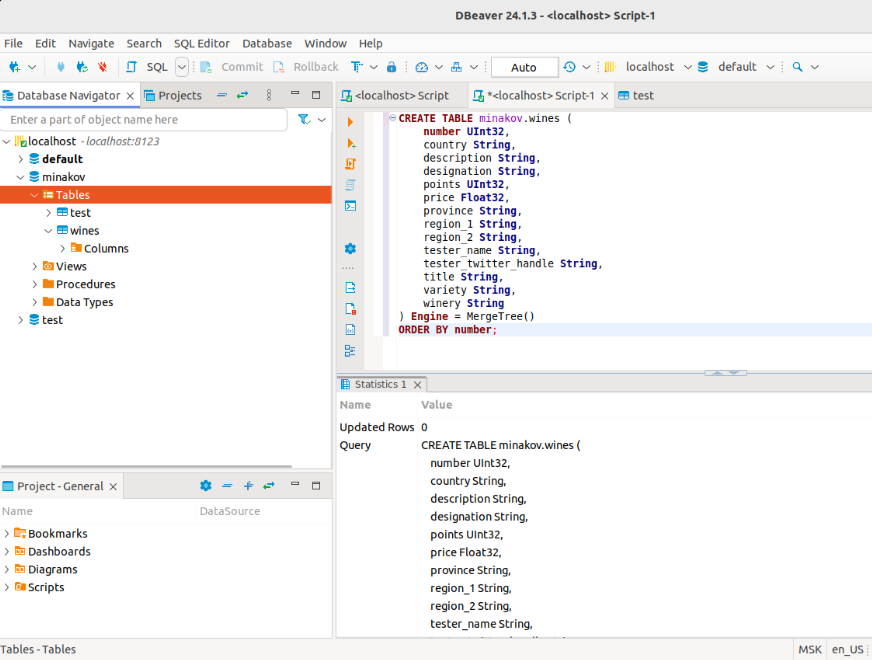
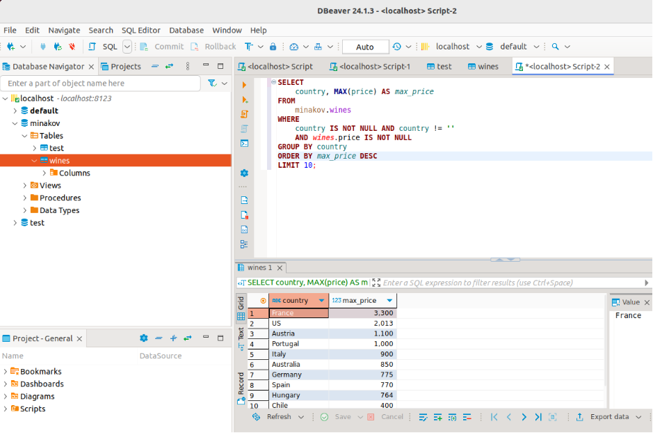

## Задание 2: Загрузка и анализ данных в ClickHouse

Перед выполнением задания рекомендуется ознакомиться с документацией по операторам:
- https://clickhouse.com/docs/ru/sql-reference/aggregate-functions/reference/count
- https://clickhouse.com/docs/ru/sql-reference/statements/select/having

Предлагается проанализировать датасет с kaggle (информация о винах): https://www.kaggle.com/datasets/zynicide/wine-reviews

Порядок действий:
- скачать датасет (файл .csv)
- проанализировать состав колонок в скачанном файле. Выбрать наиболее подходящий тип для хранения данных в каждой из колонок.
- создать таблицу в Clickhouse (рекомендуется использовать движок MergeTree и сортировку по id)
- загрузить данные из файла в ClickHouse с помощью утилиты clickhouse-client:
```shell
clickhouse-client -h 127.0.0.1 -u default --format_csv_delimiter=";" --query "insert into testdb.winemag FORMAT CSV" < winemag-data-130k-v2.csv
```
- Составить SQL-запрос для анализа данных

Анализ: 
- 1. оставить только непустые значения для названий стран и цен
- 2. найти максимальную цену для каждой страны
- 3. вывести топ-10 стран с самыми дорогими винами (country, max_price)
- 4. `*` определить как высокая цена коррелирует с оценкой дегустатора (насколько дорогие вина хорошие)
- 5. `*` учесть в выборке также регион производства

# Выполнение

Поскольку был указан пароль для подключения к БД - требовалось чуть-чуть изменить скрипт выгрузки данных из csv-файла источника





